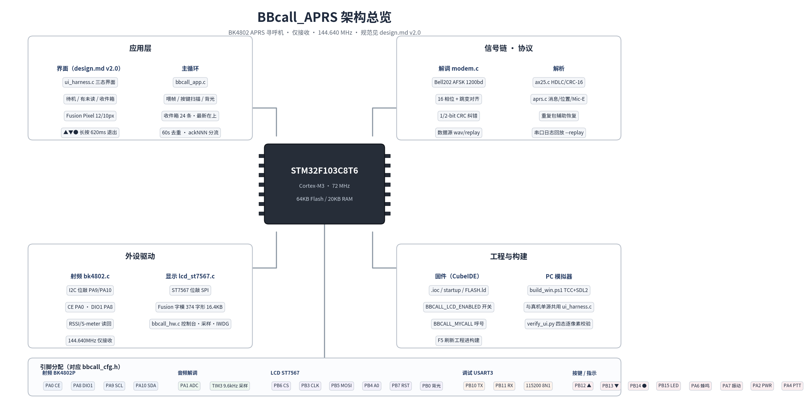
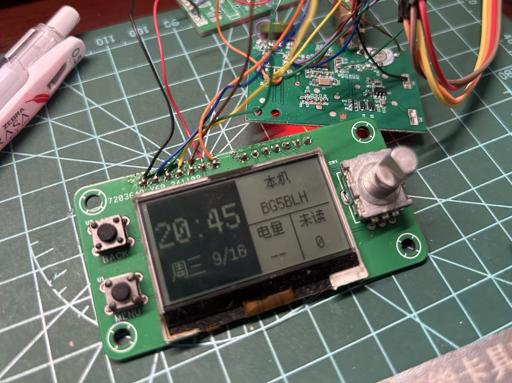
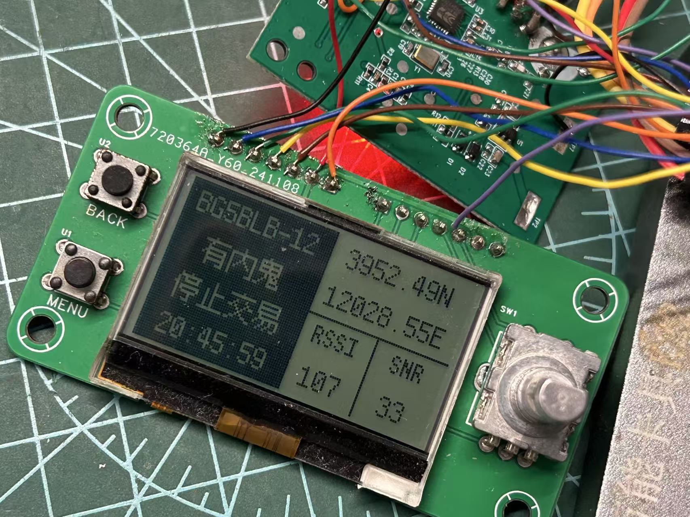
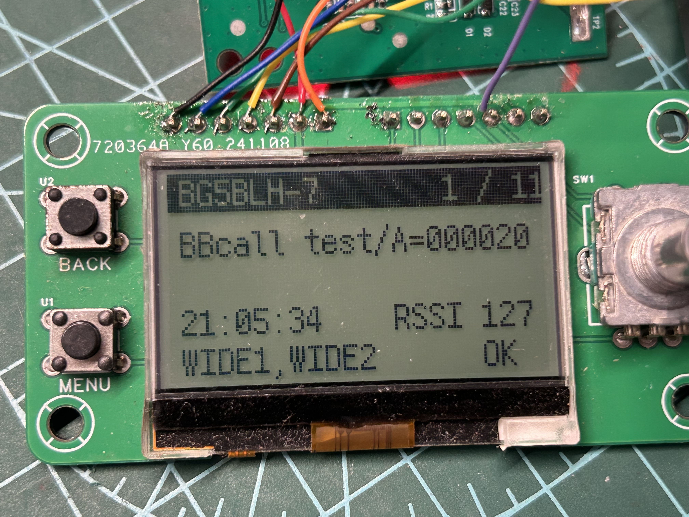

# BBcall_APRS

> **致敬与许可声明**：本项目的参考项目与工程底座是 [**MM-Radio**](https://github.com/doublehan07/MM-Radio)（BSD 2-Clause License，Copyright (c) 2024 Han Zhang）。硬件改装方案、工程结构、BK4802 驱动思路和部分寄存器初始化参考/移植自 MM-Radio，再次再次向项目作者表示感谢！

> [!CAUTION]
> **合规提示**：本项目仅用于接收（RX-only）。当前软件未实现发射功能，硬件设计不包含发射链路和 PA 功放。任何人可基于本项目进行二次创作与开发，但必须遵守本项目的 [License](https://github.com/PatrickShih774/BBcall_APRS/blob/main/LICENSE)；引用和发布必须署名。若基于本项目自行开发、改造或启用发射能力，使用者必须事先确认并遵守所在国家/地区的无线电管理法律法规，取得必要的频率、设备、功率和操作许可；未获许可发射可能违法。由此产生的一切法律风险与责任由使用者自行承担，本项目及作者不承担任何责任。

BBcall_APRS 是一个面向 2m 业余无线电频段的 APRS 寻呼机（BB 机）复刻项目，核心组合为 **BK4802P（玩具对讲 FM 收发芯片）+ STM32F103C8T6 + ST7567 12864 LCD**。当前仅接收（RX-only），默认监听 **144.640MHz**，目标是把空中收到的 APRS 数据包解析后显示在 LCD 上。

固件覆盖 BK4802P 接收配置与增益控制、音频取样、ADC、1200/2200Hz AFSK 判频、NRZI/HDLC/AX.25 解析、APRS 消息/位置/Mic-E 解析，以及 ST7567 三态 UI 和串口诊断。仓库还提供 PC 端 LCD 模拟器、测试音频生成与回归工具，便于在实机烧录前验证界面与解码链路。

**当前状态**：RF → 音频 → ADC → 判频 → NRZI → HDLC → AX.25 → APRS 全链路已打通；实机可解真实 APRS 数据包（见 [docs/DEBUG_LOG.md §10](docs/DEBUG_LOG.md#10-成功解码记录)）；LCD 已点亮、三态 UI 真机联调通过；解码优化（幅度门限 20000→500、16 相位、跳变对齐位时钟）后成功率大幅提升；射频前端无滤波/匹配是当前弱信号解码率的主要瓶颈（改进方案见 [docs/PLAN.md §11](docs/PLAN.md#11-硬件改进方案提升解码率)）。
**最新发布**：**v0.7**（2026-09-19，[Release](https://github.com/PatrickShih774/BBcall_APRS/releases/tag/BBCall_APRS_v0.7)）：**每次发射都在屏幕留一条**（重复包去重窗口 60s 改成 **2s 可配**，只合并"同一次发射的多路冗余"）+ **运行时调参命令**（`STAT?`/`GAIN=`/`AGC=`/`SQ=`/`FREQ=`…）+ `tools/serial_bridge.ps1` 串口桥；RTC 对时与命令链路已实机验证，强信号实测 **19 发 19 解**。

---

## 目录

| # | 章节 | 内容 |
|---|---|---|
| 1 | [关键决策](#1-关键决策原开放问题已确定) | MCU / 射频芯片 / 频率 / 收发 / 显示 / 调试口 |
| 2 | [引脚分配](#2-引脚分配) | → [docs/PLAN.md §2](docs/PLAN.md#2-硬件与引脚以实机为准) |
| 3 | [软件结构](#3-软件结构) | 文件表 / 架构图；信号链 → [docs/PLAN.md §3](docs/PLAN.md#3-软件架构) |
| 4 | [调试过程记录](#4-调试过程记录) | 概要 → [docs/DEBUG_LOG.md](docs/DEBUG_LOG.md)（完整 bring-up / 实测） |
| 5 | [串口诊断字段说明](#5-串口诊断字段说明) | 0.5s / 2s 周期字段 / [FRAME] 帧输出 / §5.1 对时（RTC） |
| 6 | [主机验证工具](#6-主机验证工具) | AX.25 参考 / 测试音频 / UI 校验 / 串口桥与实时调参 / 现场排障套路 |
| 7 | [STM32CubeIDE 编译与烧录](#7-stm32cubeide-编译与烧录) | 编译步骤 / 启用 LCD |
| 8 | [待办 / 下一步](#8-待办--下一步) | → [docs/PLAN.md](docs/PLAN.md)（路线图 / 验收标准） |
| 9 | [PC 端 LCD 模拟器（SDL2）](#9-pc-端-lcd-模拟器sdl2) | 概要 → [simulator/SIMULATOR.md](simulator/SIMULATOR.md) |
| 10 | [许可与合规](#10-许可与合规) | GPL-3.0 → 第三方声明与兼容性 |

---

## 1. 关键决策（原「开放问题」已确定）

| 项 | 结论 |
|---|---|
| MCU | **STM32F103C8T6**，工程目录 `firmware-stm32porject/`（用户手动建的 CubeIDE 工程） |
| 射频芯片 | **BK4802P**，21.25MHz 晶振，低中频 IF = 137kHz |
| 接收频率 | **144.640MHz**（2m），默认频点 |
| 收发 | **仅接收**，不做发射 |
| 显示 | ST7567 12864，已焊接并点亮；未启用时可设 `BBCALL_LCD_ENABLED=0` |
| 调试口 | USART3：PB10=TX、PB11=RX、115200 8N1 |
| 工程底座 | 主框架参照 [MM-Radio](https://github.com/doublehan07/MM-Radio)，代码移植进 F103 CubeIDE 工程 |

---

## 2. 引脚分配

完整引脚表与外设说明由 **[docs/PLAN.md §2](docs/PLAN.md#2-硬件与引脚以实机为准)** 维护，此处不再重复。
固件定义文件：`firmware-stm32porject/Core/Inc/bbcall_cfg.h`。

---
## 3. 软件结构

架构总览（含 STM32F103C8T6 引脚分配，渲染脚本 `tools/render_architecture.py`）：



| 文件 | 作用 |
|---|---|
| `Core/Src/bbcall_hw.c` | 时钟(72MHz)/延时/GPIO/寄存器级 USART3（TX 阻塞 + RX DMA 环形缓冲）/ADC1/TIM3 |
| `Core/Src/bk4802.c` | BK4802 位敲 I2C、RX 配置、频率字（整数运算，不引入软浮点）、增益、静噪 |
| `Core/Src/modem.c` | ADC 采样 → 1200/2200Hz 定点相关判频 → NRZI → 16 相位并行 HDLC + 跳变对齐位时钟 |
| `Core/Src/ax25.c` | CRC-16/X.25、HDLC 去填充、AX.25 地址/控制/PID/信息解析 |
| `Core/Src/aprs.c` | APRS 消息/位置/Mic-E 解析 |
| `Core/Src/lcd_st7567.c` | ST7567 位敲 SPI 驱动 + 绘图原语（`BBCALL_LCD_ENABLED` 控制启用） |
| `Core/Src/ui_harness.c` | 三态界面（待机/有未读/收件箱）与按键状态机；重复包刷新该条时间戳；模拟器与真机单源共用 |
| `Core/Src/bbcall_app.c` | 初始化、主循环、串口诊断/解码输出、串口对时命令（`TIME=`/`TIME?`）、UI 接线（按键/背光/喂帧） |
| `Core/Src/bbcall_rtc.c` | 片内 RTC 寄存器级驱动：时钟源 LSE→HSE/128→LSI、对时、秒计数器读数 |
| `Core/Src/rtc_math.c` | 纯整数公历换算与时间解析/格式化（不碰寄存器，PC 上可单测） |
| `Core/Src/strfmt.c` | 极简字符串拼装（替代 snprintf，去掉 newlib printf/malloc 约 2.2KB） |

信号链与关键实现点由 **[docs/PLAN.md §3](docs/PLAN.md#3-软件架构)** 维护，此处不再重复。

---

## 4. 调试过程记录

README 作为 GitHub 项目入口，保留概览、状态、构建入口和文档导航；完整排障过程由 **[docs/DEBUG_LOG.md](docs/DEBUG_LOG.md)** 维护。

| 主题 | 摘要 | 详细记录 |
|---|---|---|
| 成功解码记录 | RF → ADC → HDLC → APRS 全链路已在实机解出真实 APRS 包 | [DEBUG_LOG §10](docs/DEBUG_LOG.md#10-成功解码记录) |
| 解码优化 | 幅度门限、16 相位、跳变对齐位时钟大幅提升成功率 | [DEBUG_LOG §9](docs/DEBUG_LOG.md#9-解码成功率优化阈值--16-相位--跳变位时钟) |
| LCD 与三态 UI | ST7567 硬件排障、三态 UI 真机接入、帧级 RSSI/SNR | [DEBUG_LOG §11](docs/DEBUG_LOG.md#11-实机联调lcd-点亮--三态-ui--帧级-rssisnr2026-09-16) |


**实机烧录效果**

| HOME 待机 | NEW 有未读 | MESG 收件箱 |
|---|---|---|
|  |  |  |

---

## 5. 串口诊断字段说明

每 500ms：

```
S=009 MK=xxxx SP=xxxx OT=xx A0=xxxx A1=xxxx M=000
```

| 字段 | 含义 |
|---|---|
| `S` | S 表（RSSI 映射，1–9，最小显示 1） |
| `MK` | 本 0.5s 判为 1200Hz mark 的采样数 |
| `SP` | 判为 2200Hz space 的采样数 |
| `OT` | 幅度过低/无法判别的采样数 |
| `A0/A1` | ADC 原始值的最小/最大值（偏置约 1860，用于判断摆幅/削波） |
| `M` | 软件静噪状态（1=静音，0=放行） |

每 2s：

```
R19=36879 RSSI=00127 SNR=00063 G=006 RX=00012 U=00003 DUP=00005 FIX=00000 FIX2=00000 REP=00000 I2CE=00000 AFC=00047 EXN=00001 R22=0C00 R23=64FF ID=18434 T=001 P=02109
```

| 字段 | 含义 |
|---|---|
| `R19/R22/R23` | BK4802 寄存器回读（增益/静噪配置） |
| `RSSI/SNR/EXN` | 信号强度/信噪比/带外噪声 |
| `AFC` | 剩余频偏 |
| `G` | 自适应中频增益档位（4=12dB、5=15dB、6=18dB） |
| `RX/U/DUP` | 累计接收帧数 / 独立台站数 / 同一发射的多路冗余数（默认 2 秒窗口内同源同内容，见 §5.2 的 `DUPMS=`） |
| `FIX/FIX2` | 1-bit / 2-bit CRC 纠错成功帧数 |
| `REP` | 参考帧辅助恢复（重复包）成功帧数 |
| `I2CE` | I2C 错误/重试计数 |
| `ID` | 芯片 ID（0x4802=18434） |
| `T` | 最近判出的音调（0=无、1=mark、2=space） |

每解出一帧，`[FRAME]` 行末尾还会带上这条消息的强度与来源：

```
 RSSI=073 SNR=019 (decode-now)      # 解码当刻直读寄存器 24 成功
 RSSI=073 SNR=019 (peak-fallback)   # 当刻读失败，用了 1s 接收窗口峰值
 RSSI=-- SNR=--                     # 连采样都没有（界面同样显示 --）
```

解码事件（`[T=...ms]` 为本次上电后的毫秒时间戳）：

```text
[T=12345ms]
[RAW] len=47 hex=...
[FRAME] src=BG5BLH dest=APRS path=(none) ctrl=3 info=:BG5BLH   :Hello APRS 144.640
 msg=Hello APRS 144.640
[T=12680ms] [DUP] src=BG5BLH
[T=20010ms] [FIX] [RAW] ...        （1/2-bit 纠错成功）
[T=21000ms] [REP] [FRAME] ...      （参考帧辅助恢复）
```

- `[FRAME]`：新解码帧；`[MICE]`/`[POS]`：Mic-E / 普通位置解析；
- `path=...`：中继路径，带 `*` 表示该中继已转发；
- `[DUP]`：**同一次发射的多路冗余**（默认 2 秒窗口内、同源同内容）：屏上不新增条目，只把已入箱那条的时间戳刷新为本次接收时刻、提到队首并重新标为未读；`[FIX]`/`[FIX2]`/`[REP]`：纠错或参考恢复的帧；
- 时间戳来自 `HAL_GetTick()`，复位后从 0 开始，便于把解码事件与手工发射时刻一一对应。`[I2C]` 行只在 BK4802 读失败时出现（`scl`/`sda` 是释放后的空闲电平、`ack=1` 表示芯片有应答），排查见 [DEBUG_LOG §19](docs/DEBUG_LOG.md#19-bk4802-i2c-全-0xffff怎么判往哪儿查2026-09-18-晚)。

### 5.1 对时：把 PC 系统时间写进片内 RTC

**没焊串口也能有真实时间**：RTC 还没被对过时（首次上电、或掉电后），固件直接用**编译时间戳**（`__DATE__`/`__TIME__`）给 RTC 对时，
值就是你在 CubeIDE 点 Build 的那一刻：编译完直接烧录，屏幕（锁屏页时钟 + 消息时间戳）就是当前时间，
误差只有"编译到上电"的这几分钟。开关在 `bbcall_cfg.h` 的 `BBCALL_RTC_SEED_BUILD_TIME`（默认 1，置 0 关闭）。
上电串口会打 `[RTC] cfg=1 src=LSE lse=142ms trim=+0ppm (eff=+0ppm) div=32767 seeded=2026-09-18 00:37:12`，
其中 `seeded=` 就是写进 RTC 的编译时间，`lse=` 是这次上电 32.768k 晶振的起振用时。

接上串口后可以改成精确时间（会覆盖设备里 RTC 的值），锁屏页时钟与消息时间戳都跟着走：

```powershell
powershell -ExecutionPolicy Bypass -File tools\set_rtc_time.ps1          # 自动找串口并对时
powershell -ExecutionPolicy Bypass -File tools\set_rtc_time.ps1 -Query   # 只回读设备时间
powershell -ExecutionPolicy Bypass -File tools\set_rtc_time.ps1 -List    # 列出可用串口
powershell -ExecutionPolicy Bypass -File tools\set_rtc_time.ps1 -TrimPpm 520  # 只设走时校准（正=走快）
```

设备侧命令（串口助手里手敲也一样）：`TIME=2026-09-18 22:30:00` 写入，`TIME?` 回读，
回复形如 `[RTC] set 2026-09-18 22:30:00 Fri src=HSE/128`。

- **时钟源可配置**（`bbcall_cfg.h` 的 `BBCALL_RTC_CLK_SRC`）：**本工程默认 `1` = 只用 LSE 32.768k 晶振**；`0` = 自动（LSE → HSE/128 = 62.5kHz → LSI，兼容没焊晶振的板子）；`2` = 只用 HSE/128；`3` = 只用 LSI；
  强制 LSE 时晶振起振失败会**明确报错、不静默换源**：`[RTC] cfg=1 src=none ERR: no RTC clock source (cfg=1 -> check 32.768k crystal / load caps)`，屏幕退回默认墙钟；
  正常时上电打 `[RTC] cfg=1 src=LSE lse=142ms trim=+0ppm (eff=+0ppm) div=32767 time=... wday=5`，`lse=` 是起振用时、`div` 是当前分频比；
  （`BBCALL_RTC_SEED_BUILD_TIME` 置 0 时不再自动用编译时间戳兜底，改为 `no-time (send TIME=...)`，只能靠串口对时。）
- 没有 VBAT 电池时**掉电会丢时间**：下次上电自动回到编译时刻（或跑脚本改成 PC 当前时间）；普通复位/重新烧录不会丢；
- 串口接收走 **DMA1_Channel3 环形缓冲**：不占 9600Hz 采样中断的时间预算，也不会因为主循环正在打印 `[RAW]` 而丢命令字节；
- 对时后设备每秒跟 RTC 查一次（跨零点、手动改时间都会立刻反映到屏幕）。

**走时精度与校准**（2026-09-18 追加）

- 精度取决于时钟源：**LSE（32.768k 晶振）约 ±20ppm ≈ ±2 秒/天**；**HSE/128（借主板 8MHz 晶振）±20~50ppm ≈ ±2~4 秒/天**；
  LSI（内部 RC，30~60kHz）是**分钟到小时级**误差，只做最后兜底；
- 一天下来差了几分钟以上时，先排除两件事：① 板上有没有 32.768k 晶振（本工程默认只用 LSE，起振失败会报错）；
  ② **中途有没有断过电**：没有 VBAT 电池时，每次掉电都会在下次上电把时间重置成"编译时刻"（编译完隔多久才烧录，就差多久）；
- **标定（推荐流程）**：① 跑一次 `set_rtc_time.ps1` 对时；② 隔 T 小时（建议 24h，中途别断电）跑 `-Query`，
  脚本会直接打印"与 PC 相差 Δ 秒"（设备快为正）；③ 用 `-TrimPpm Δ/(T×3600)×1e6` 写入。
  例：24 小时快 4.3 秒 -> 4.3/86400 = 50ppm -> `-TrimPpm 50`；LSE 一档 30.5ppm（2.6 秒/天），一般 ±3 秒/天以内；
- **手动等价命令**：`TRIM=+520` 表示"走快了、要减慢"（正 = 快）；
  例：24 小时快 45 秒 -> 45/86400 = 520ppm -> 串口发 `TRIM=520`，该值存在备份寄存器里，复位不丢；
  没焊串口就改 `bbcall_cfg.h` 的 `BBCALL_RTC_TRIM_PPM`（全新备份域的初值），重新编译烧录；
  分辨率：LSE 一档 30.5ppm（2.6 秒/天），HSE/128 一档 16ppm（1.4 秒/天）；
- 上电串口会打印 `[RTC] cfg=1 src=LSE lse=142ms trim=+0ppm (eff=+0ppm) div=32768`：
  `lse=` 是本次上电 32.768k 晶振的起振用时（`--` 表示这次沿用了已有备份域、没重新起振，属正常）；
  `div` 是实际写进 RTC 的分频比（LSE 应为 32768、HSE/128 为 62500），`eff` 是量化后实际生效的 ppm；`TRIM?` 可随时回读。
  注意 `div` 来自软件记录：STM32F1 的 RTC 预分频寄存器是**只写**的，读回来的值无意义（曾经因此显示出 32769）。

### 5.2 运行时调参命令（串口，不用重烧）

配合 `tools/serial_bridge.ps1`（常驻串口 + 从命令文件发命令），可以让 Codex 或脚本直接对接设备实时调参：

```powershell
# 终端 A：占用串口，实时打印设备输出（Ctrl+C 退出）
powershell -ExecutionPolicy Bypass -File tools\serial_bridge.ps1 -Port COM5
# 终端 B / 任何进程：把命令写进这个文件即发送（每行一条，发完自动删除）
"STAT?" | Out-File -Encoding ascii "$env:TEMP\bbcall_tx.txt"
```

| 命令 | 作用 |
|---|---|
| `STAT?` | 一行打包 RSSI/SNR、G/AGC/SQ、FREQ、I2CE/ID、RX/U/DUP/FIX/REP、ISR 耗时、RTC 时间 |
| `GAIN=<0..7>` | 固定中频增益（3dB/级 → 0..21dB），并**关掉 AGC** |
| `AGC=<0/1>` | 自动增益开/关（默认值来自 `bbcall_cfg.h` 的 `BBCALL_IF_AGC`） |
| `SQ=<0..255>` | reg22 低字节：RSSI 静噪阈值 |
| `SQN=<0..255>` | reg23 低字节：噪声阈值 |
| `FREQ=<kHz>` | 重新设接收频率，如 `FREQ=144640` |
| `MUTE=<0/1>` | 接收音频断/通 |
| `PING` | 探活，回 `[CFG] pong` |
| `DUPMS=<ms>` / `DUPMS?` | 重复包去重窗口：**默认 2000ms**（只合并同一次发射的多路冗余）；设 0 关闭去重 |
| `TIME=` / `TIME?` / `TRIM=` | 对时与走时校准（见 §5.1） |

**注意 Flash 预算**：这套命令约 2KB，`Debug` 配置（`-O0`）会超出 64KB（溢出 1484 字节），
所以带调参命令的固件请用 **`Release` 配置（`-Os`）** 构建（同一份源码省约 15.5KB），
或者把 `bbcall_cfg.h` 的 `BBCALL_TUNE_CMDS` 置 0 只保留对时命令。

---

## 6. 主机验证工具

```powershell
# AX.25/APRS 参考实现自测
python tools/ax25_reference.py

# BK4802 频率字
python tools/bk4802_freq.py

# 生成标准 1200 baud APRS 测试音频（LSB-first）
python tools/gen_afsk_wav.py tools/test_aprs_144.wav

# 生成带 VOX 触发的版本（150ms 触发音 + 150ms 保持音 + 数据）
python tools/gen_afsk_wav.py --vox tools/test_aprs_144_vox.wav

# 指定呼号(可带 SSID) + APRS 消息（屏幕上显示成 呼号 + 正文）
python tools/gen_afsk_wav.py --src BG5BLB-12 --addressee BG5BLH ^
    --msg "有内鬼 停止交易" -o tools/test_bg5blb12_msg.wav

# 位置帧：随机经纬度 + 注释文字（未读页会显示经纬度）
python tools/gen_afsk_wav.py --src BG5BLB-12 --pos --random-pos --seed 20260916 ^
    --comment "有内鬼 停止交易" -o tools/test_bg5blb12_pos.wav
```

`tools/test_aprs_144.wav` 的内容是 `APRS → BG5BLH` 的 APRS 消息。实机测试用的是**标准位置帧**：
`tools/test_bg5blb12.wav`（一条包同时带呼号 `BG5BLB-12`、经纬度 `3952.49N/12028.55E`、注释「有内鬼 停止交易」）；
另有两个变体：`test_bg5blb12_msg.wav`（`:` 消息帧，只有正文、不带位置）、`test_bg5blb12_pos.wav`（同位置帧），
都各有一份 `_vox` 版本（前面加 150ms 触发音 + 150ms 保持音）。

> **修过的坑**：`bitstuff_bytes()` 把填充后的比特流按整字节打包，当填充后比特数不是 8 的倍数时，
> 收尾 flag 前会多出 0~7 个 0 位，接收端把它们当成帧内容 -> 帧长错、CRC 失败（位置帧最容易命中，
> 现象是"怎么都解不出"）。已新增位级填充 `bitstuff_bits()` 并改用它；原先那条 `Hello APRS 144.640` 
> 恰好字节对齐，所以这个 bug 一直没暴露。

主机侧用仓库里的 `tools/verify_ui.py` 可以逐像素核对屏幕内容（呼号/经纬度/正文/RSSI/SNR）；
模拟器加了 `--rf R,S`，复现真机"解码当刻取到 RSSI/SNR"的那条路径。

```
:BG5BLH   :Hello APRS 144.640
```

主机的同算法仿真可解出 `len=47, CRC=True`。

### 6.1 调试工具总览（2026-09-19 联调沉淀）

| 工具 | 用途 | 典型命令 |
|---|---|---|
| `tools/serial_bridge.ps1` | **常驻串口桥**：实时打印设备输出 + 从"命令文件"发命令（让 Codex/脚本直接驱动设备） | `powershell -ExecutionPolicy Bypass -File tools\serial_bridge.ps1 -Port COM5` |
| `tools/set_rtc_time.ps1` | PC 系统时间写进片内 RTC；`-Query` 还会打印**与 PC 的时差**，`-TrimPpm <ppm>` 标定走时 | 见 §5.1 |
| `tools/test_rtc_math.c` | 日期换算 / 编译时间戳 / ppm 校准的主机自测（TCC 直接跑，不碰硬件） | `third_party\tcc\tcc\tcc.exe -I firmware-stm32porject\Core\Inc -o %TEMP%\rtc.exe tools\test_rtc_math.c; %TEMP%\rtc.exe` |
| `tools/regression_baud.ps1` | host 侧频偏回归：生成 ±x% 波特率素材，对比软/硬判决帧数 | `powershell -ExecutionPolicy Bypass -File tools\regression_baud.ps1` |
| `tools/verify_ui.py` | 模拟器截图逐像素核对（呼号/经纬度/正文/RSSI/SNR/未读数） | `python tools\verify_ui.py shot.bmp unread` |
| `tools/gen_afsk_wav.py` | 生成标准 / VOX / 位置 / 消息测试音频（`--baud-bias` 造频偏） | 见本节上方 |
| `tools/make_hex.ps1` | ELF → HEX/BIN（手编后出烧录文件） | `powershell -ExecutionPolicy Bypass -File tools\make_hex.ps1` |
| `simulator/` | PC 端 ST7567 模拟器，与固件共用 `ui_harness.c`，不烧录就能验 UI 与解码 | `powershell -ExecutionPolicy Bypass -File simulator\build_win.ps1 -Run` |

### 6.2 让 AI / 脚本直接驱动设备（串口桥工作流）

串口是**独占**的，所以由 `serial_bridge.ps1` 一个进程同时管收发：

1. 关掉串口助手（SSCOM 等），确认 **PB10(TX)→适配器 RX、PB11(RX)←适配器 TX、共地**；
2. 起桥（可选 `-LogFile` 落盘）：
   `powershell -ExecutionPolicy Bypass -File tools\serial_bridge.ps1 -Port COM5`
3. 发命令：任何进程只要往命令文件写一行就行（桥发完自动删文件）：
   `"STAT?" | Out-File -Encoding ascii "$env:TEMP\bbcall_tx.txt"`
4. 设备回复直接出现在桥的输出里（`[CFG]` / `[STAT]` / `[RTC]` 行），可以边调边看。

配合 §5.2 的**运行时调参命令**（`GAIN=` / `AGC=` / `SQ=` / `SQN=` / `FREQ=` / `MUTE=` / `STAT?` / `PING`），
改参数**不用重烧**：改完立刻用 `STAT?`、`R19=`、`[FRAME]` 看效果，最后再把满意的值写回 `bbcall_cfg.h`。

**踩过的坑（已在脚本/固件里处理）**：

- 一次写入多条、背靠背发送时，设备偶尔读坏第一条（实测 `TIME=`+`TIME?` 连发时第一条回 `err`）→ 桥现在**每条之间等 200ms**；
- 带调参命令的固件 `Debug`(-O0) **装不下**（溢出 1484 字节）→ 用 `Release`(-Os)，见 §7；
- 端口被别人占用会直接报 `Access to the port 'COM5' is denied`，先关掉串口助手。

### 6.3 现场排障套路（实战验证）

| 现象 | 一步定性 | 判读 |
|---|---|---|
| BK4802 读寄存器全 `FFFF` | 看固件自动打印的 `[I2C] no response: scl=? sda=? relPA8=? ack=?` | `scl`/`sda` = 0 → 总线被拉死/短路；两者=1 且 `ack=0` → 线是好的、芯片不应答（查供电/CE/21.25MHz 晶振/模块）；`relPA8=1` → SCL 被 PA8(DIO1) 拉低，PA8/PA9 在 LQFP48 上相邻，八成连锡 |
| 串口发命令没反应 | 短接板上 **PB10 ↔ PB11**（相邻两脚） | 日志随即刷出 `[RTC] err: use TIME=...` → MCU 接收链路（PB11→DMA→解析）正常，问题在 USB-TTL→PB11 那根线或焊点 |
| 怀疑 USB-TTL | 拔下适配器，短接它自己的 **TX ↔ RX**，再让对面发一串字符 | 能回显 = PC 与适配器正常；不能 = 换适配器 |
| 一天时差偏大 | `set_rtc_time.ps1 -Query` 看 Δ | 无 VBAT 时**掉电会重置成编译时刻**（最常见误判）；LSE 正常约 ±2 秒/天，超出用 `-TrimPpm Δ/(T×3600)×1e6` |
| 收不到包但命令正常 | `STAT?` | 看 `RSSI/SNR/G/AGC/I2CE/ID/RX/U/DUP/ISRavg/ISRmax`：一眼分清是射频增益、I2C、还是解码层的问题（ISR 预算 104µs） |

---

## 7. STM32CubeIDE 编译与烧录

1. 打开 `firmware-stm32porject/` 工程（用户手动建的 STM32F103C8Tx 工程）。
2. 确认 `Core/Src`、`Core/Inc` 已加入构建（**新增的 `bbcall_rtc.c`、`rtc_math.c` 也要在构建里**：CubeIDE 里按 F5 刷新工程即会自动扫描到，`Debug/` 是生成目录、不入库）；`main.c` 的 USER CODE 区已调用
   `hw_delay_init()/hw_clock_try_72mhz()`、`bbcall_app_init()`、`bbcall_app_loop()`。
3. Build（0 错误即可）。
4. 烧录后打开 USART3（PB10/PB11，115200）看串口输出；
5. **构建配置**：`Debug`(-O0) 与 `Release`(-Os) **现在都能装下**（Debug：`text=65132`，余 336 字节；Release：`text=47404`，余约 18KB）。
   加新功能前先看余量：Debug 快满时把 `BBCALL_TUNE_CMDS` 置 0（省约 2.6KB）或改用 Release；
   另外固件已不用 newlib printf/malloc（见 [DEBUG_LOG §23](docs/DEBUG_LOG.md#23-代码内存优化去掉-newlib-printf让-debug-o0-也能装下2026-09-19)），别再引入 `printf/snprintf/malloc`。
6. **Release 配置不产出 `.hex`**（只有 elf/list/map）：用 `powershell -ExecutionPolicy Bypass -File tools\make_hex.ps1 -Elf firmware-stm32porject\Release\BBCall_APRS.elf` 生成，或在 CubeIDE 里直接 Run（烧 elf）。

LCD 焊好后把 `bbcall_cfg.h` 的 `BBCALL_LCD_ENABLED` 改成 1 即可启用显示。

---

## 8. 待办 / 下一步

BB 机功能规划（v0.4 → v1.0）、版本路线、验收标准与当前优先级全部在 **[docs/PLAN.md](docs/PLAN.md)**，此处不再重复。

当前最高优先级：**建立漏包率基线 → 软件链路观测/验证 → 射频前端改进**（方案见 [docs/PLAN.md §10](docs/PLAN.md#10-下一步方案把漏包率降下来v05-之后)）。

v0.6 的实机验证清单（先做完这三条，再谈漏包率）：

- [ ] 上电看 `[RTC] src=...` 是哪一档、锁屏页时钟是否为编译时刻，跨零点后日期是否自动翻；
- [ ] 同一包连发两次：收件箱仍是 1 条、时间戳刷新成第二次（串口 `DUP=` 加 1）；
- [ ] （焊上串口后）`powershell -ExecutionPolicy Bypass -File tools\set_rtc_time.ps1` 能回读到与 PC 一致的时间。

---

## 9. PC 端 LCD 模拟器（SDL2）

用 SDL2 在 PC 上模拟 ST7567 128×64 单色点阵，**直接编译固件里的代码**（`lcd_st7567.c`、`ui_harness.c`、`ax25.c`、`aprs.c`、`modem.c`），无需烧录即可看屏幕效果和验证解码链路。

> **完整文档**：[simulator/SIMULATOR.md](simulator/SIMULATOR.md)（命令行参数 / 按键映射 / 导航模型 / 构建坑 / SEG 方向与列偏移）。
> **UI 规范**：[docs/design.md](docs/design.md)（唯一权威规范：骨架 / 三态 / 硬规则 / 验证）。

快速构建：

```powershell
powershell -ExecutionPolicy Bypass -File simulator\build_win.ps1 -Run       # Windows 免安装工具链（TinyCC/SDL2 不入库，需本地按 SIMULATOR.md 准备）+ 打开窗口
# 其它构建方式（CMake / Makefile）与完整命令见 simulator/SIMULATOR.md
```

三种数据源（`--demo` / `--replay` / `--wav`）与验收方法详见 [simulator/SIMULATOR.md](simulator/SIMULATOR.md)。

---

## 10. 许可与合规

- 本项目代码与文档如无特别说明，按 **GNU General Public License v3.0（GPL-3.0）** 分发，见根目录 [`LICENSE`](LICENSE)。
- 参考项目、第三方字体 / SDK / 数据手册、许可证兼容性与分发合规要求，统一见 **[licenses/THIRD_PARTY_LICENSES.md](licenses/THIRD_PARTY_LICENSES.md)**，此处不再重复。
- `docs/BK4802P.pdf` 仅作为 BK4802P 学习与开发参考；版权与再分发限制见第三方声明。
