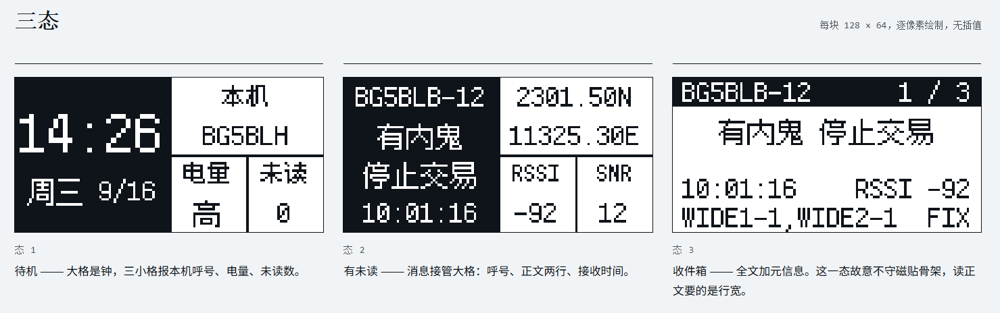

# BBcall_APRS 调试过程记录

本文件记录从 BK4802P、音频链路、AFSK/AX.25 解码到 ST7567 LCD / 三态 UI 的完整 bring-up 过程。每条记录尽量保持「现象 → 根因 → 修复 → 验证」，便于复现和回归。

## 快速索引

| 主题 | 结果 / 用途 |
|---|---|
| [频率字与显示](#1-频率字与显示) | 144.640MHz 频率字计算与寄存器回读对齐 |
| [RSSI 恒 0](#2-rssi-恒-0收不到信号) | reg23 收发状态与 RX 通路修复 |
| [强信号下 I2C 读失效](#3-强信号下-i2c-读失效) | RF 干扰下的时序稳定与恢复 |
| [音频取样](#4-音频引出audc-不是音频输出) | EAROP / D 类 PWM / ADC 前端结论 |
| [AFSK 判频与解码](#8-afsk-判频方案的三次演进) | 从捕获周期到 ADC + 并行 HDLC |
| [解码成功率优化](#9-解码成功率优化阈值--16-相位--跳变位时钟) | 阈值、16 相位、跳变对齐位时钟 |
| [成功解码记录](#10-成功解码记录) | 实机真实 APRS 包输出证据 |
| [LCD 与三态 UI 实机联调](#11-实机联调lcd-点亮--三态-ui--帧级-rssisnr2026-09-16) | ST7567 硬件排障与 UI 接入 |
| [固件功能与审计修复](#12-固件功能与审计修复v03) | v0.3 功能清单、安全审计修复与实测 |

---

## 1. 频率字与显示

**现象**：启动打印 `[FREQ] want r1=08A0`，读回却是 `089A`；显示频率为 144.639MHz。

**根因**：

- BK4802P 用 21.25MHz 晶振、低中频 IF=137kHz，RX 时 PLL 锁定在 `LO = RF - IF`：

  ```
  value = (RF - 0.137) × Ndiv × 2^24 / 21.25
  ```

  144.640MHz、Ndiv=12 → `reg2=0x2004 / reg0=0x519A / reg1=0x08A0`。
- 代码用 `float` 存 144.640f，实际是 144.639999…，算出的频率字低了 6 LSB（约 0.6Hz），
  格式化时又截断成 639。

**修复**：频率计算和打印改用 `double`，`BBCALL_DEF_FREQ_MHZ` 定义为 `144.64`。
修改后启动打印：

```
[BBcall] RX 144.640 MHz
[FREQ] want r2=2004 r0=519A r1=08A0
[FREQ] read r2=2004 r0=519A r1=08A0
```

## 2. RSSI 恒 0（收不到信号）

**现象**：`R19=08207 RSSI=00000 SNR=00000 ID=18434`，无论有无信号都不变化；
近距离强信号时读数被打成全 1（`RSSI=255 / SNR=63 / ID=65535`）。
换 437.625MHz 也一样，说明与频段无关。

**根因**：MM-Radio 初始化写 `reg23 = 0x60FF`，把 `reg23<10>` 清 0。
按 BK4802P 手册，此时收发状态改由 **TRX 引脚**控制（高=TX、低=RX）。
MM-Radio 原板 TRX 被拉低；本板 TRX 悬空，芯片停在 TX/不确定态，
RF 开关切到发射通路，RX 前端等于关闭，所以 RSSI 恒 0。

**修复**（`bk4802.c` 的 `bk4802_enter_rx()`）：

```c
/* reg23 = 0x64E0
 *   B15=0 关自动省电
 *   B10=1 收发状态由 reg23<9> 控制，不依赖 TRX 引脚
 *   B09=0 数字部分强制 RX
 *   B08=0 PIN24 保持 RSSI 输出 */
bk4802_write_reg(23, 0x64E0u);
/* rxcfg 里 reg9 = 0xE0E4：RF 开关接接收通路 */
/* 写完 reg4..22 后再次写 reg23，把状态锁死在 RX */
bk4802_write_reg(23, 0x64E0u);
```

**结果**：RSSI/SNR 随手台信号变化，`ID` 保持 0x4802，144.640MHz 实机可收。

> 结论：`reg23=0x60FF` 只在 TRX 引脚被可靠拉低的板上成立；TRX 悬空的板子
> 必须用寄存器控制（B10=1、B09=0）。

## 3. 强信号下 I2C 读失效

**现象**：手台靠近时读到 `R19=65535 / ID=65535`。这是长导线拾取强 RF 后再做位敲 I2C，
从机 ACK/数据位被干扰，不是芯片坏。

**处理**：`bk4802_read_reg()` 的 I2C 时序里加了稳定等待；关键写入（reg23 锁 RX、
软件静噪恢复）连写两次防止被冲掉。日常使用保持 I2C 线尽量短。

## 4. 音频引出：AUDC 不是音频输出

**问题**：想找一个"没经过功放的 FM 解调音频"引脚，怀疑是 AUDC。

**结论**：不是。BK4802P 手册里：

- `AUDC`：麦克风放大器的共模节点，只外接 1µF 到地，不是音频信号输出；
- `ASKOUT(PIN24)`：ASK 解调的数字判决输出，不能解 AFSK；
- 接收音频链全在片内：FM 解调 → 去加重 → 3.1kHz LPF → HPF → 音量 → **D 类音频功放**
  → `EAROP/EARON` 差分输出 → 喇叭。

所以可取的只有 **EAROP/EARON（或喇叭焊盘）**；
并且它是 **D 类 PWM 输出（约 50–100kHz 载波）**，不能直接给 MCU，必须滤波。

## 5. 音频取样电路

最终电路：

```
EAROP ── 104(100nF) ── R 1kΩ ──┬── 103(10nF) ── GND
                               ├── 10kΩ ── 3.3V
                               ├── 10kΩ ── GND
                               └── PA1
```

调试中发现的问题：

- **只加 103 不加串联电阻**：104 在 100kHz 时阻抗只有约 16Ω，低通截止仍在 ~100kHz，
  PWM 载波原样进来，表现为 `C`/`MK` 每秒几万次；必须串 1k（和 103 组成 ~16kHz 低通）。
- **喇叭是 D 类功放的负载**：喇叭接着时输出被拉低；把喇叭去掉后 PA1 摆幅可到 2Vpp。
- **偏置**：10k/10k 把静态点定在 ~1.5V；F103 的门限约 1.16V/1.83V，
  所以音频摆幅需要 >0.67Vpp 才能稳定翻转（后改走 ADC 后不再依赖门限）。
- 实测：无信号时 Vpp≈1V（噪声+载波残留），发射时 AFSK Vpp≈0.6–2V。

## 6. PA1 的 GPIO 配置

**现象**：接了音频但 `T/P=0`，`L` 恒 0。

**根因**：F103 上定时器输入捕获引脚被配成了 `GPIO_MODE_AF_PP`（复用推挽输出），
外部信号进不了输入路径。

**修复**：改 `GPIO_MODE_INPUT` 后 `L` 能正确跟随偏置。
（后来走 ADC 方案，PA1 改为 `GPIO_MODE_ANALOG`。）

## 7. 增益与失真、静噪

**现象**：

- 21dB 中频 + 音量 15 + 解调幅度 2：信号严重破音；
- 降到 12dB/音量 12/幅度 1 后不破音，但无信号出现沙沙声。

**原因**：BK4802 的静噪是**基于噪声门限**的：

- 高增益时无信号噪声 EXN≈630，高于开喇叭门限（224×2）→ DSP 保持关喇叭，所以安静；
- 降增益后噪声 EXN≈320，低于门限 → DSP 误判为有信号，把功放打开 → 沙沙声。

**调过的参数**（寄存器定义见 `bk4802.c` / `bbcall_cfg.h`）：

- `reg7 B15:B13`：中频增益，3dB/级（0–21dB）；
- `reg19 B15:B14`：CIC 增益（0/1/3.5/6dB）；
- `reg19 B13:B12`：FM 解调输出幅度；
- `reg19 B03:B00`：接收音量；
- `reg22`/`reg23`：静噪噪声/RSSI 阈值；
- `reg4 B11`：接收音频开关（软件静噪用）。

**当前选择**（为解码保留足够音频摆幅）：

| 项 | 值 | 寄存器结果 |
|---|---|---|
| 中频增益 | 12dB | `reg7=0x8D00` |
| CIC 增益 | 3.5dB | `reg19 B15:14=2` |
| 解调幅度 | 1 | `reg19 B13:12=1` |
| 音量 | 15 | `reg19 B3:0=15` |
| 静噪 | 关闭 | `reg22=0x0C00`、`reg23=0x64FF` |
| 软件静噪 | 关闭 | `BBCALL_SW_SQUELCH=0` |

对应日志：`R19=36879`（0x900F）。

**软件静噪的尝试与结论**：

- 音量 0 压不住 D 类功放底噪，必须用 `reg4 B11=1` 关接收音频通路；
- 第一版用 "RSSI 与 EXN" 双重条件，强信号下 I2C 读 EXN 出错导致一直不放行（发射没声音）；
- 改成只看 RSSI，并在恢复时重锁 reg23，可正常"无信号静音、有信号出声"；
- 最后为了解码测试，暂时把寄存器静噪和软件静噪都关闭（音频常开）。
  后续做产品时再根据实际听感标定阈值。

## 8. AFSK 判频方案的三次演进

**第一版：TIM2_CH2 捕获周期**

- 原理：PA1 上升沿测周期，833µs→mark、455µs→space；
- 结果：接 EAROP 原始 D 类 PWM 时 `P` 只有几十 µs；滤波后 `T/P` 仍对不上。

**第二版：去抖 + 音调跳变复位位时钟**

- 加 <250µs 毛刺过滤；检测 mark↔space 跳变复位相位；
- 结果：偶尔能出 `T=002`，但出不了帧。

**根因分析（主机仿真）**：

1. 一个比特的短音调（例如 flag 里的单个 mark）在过零周期法里会整位丢失；
2. `ax25.c` 的 HDLC 移位寄存器按 **MSB-first** 左移，而 AX.25 是 **LSB-first**；
   0x7E 标志因为对称还能认出来，帧体字节却全被位反转，CRC 永远不过；
3. 检测到 0x7E 标志后没有清零移位寄存器，后续字节错位；
4. `tools/gen_afsk_wav.py` 生成的测试音频也是 MSB-first，导致"标准测试音频"本身解不出，
   掩盖了上述问题。

**修复**：

- `ax25.c`：HDLC 改为 `shift = (shift>>1) | (bit<<7)` 的 LSB-first 方式，
  标志检测后清零 `shift`；字节装配同样右移；
- `tools/ax25_reference.py`：位填充/去填充改为 LSB-first；
- `tools/gen_afsk_wav.py`：改为 LSB-first 并重新生成 `tools/test_aprs_144.wav`。

**第三版：ADC 采样 + 8 相位并行解码**

- PA1 改为 `ADC1_IN1`，TIM3 以 **9600Hz**（1200 baud×8）触发采样；
- 每个采样点对最近 8 点做 1200/2200Hz 定点相关（Goertzel），比较幅度判音调；
- 按采样相位分成 **8 路并行 NRZI+HDLC**，每路每 8 个采样得一个比特；
- 只有 CRC 正确的帧才进入邮箱，避免错误相位产生垃圾帧；
- 主机用同一算法对标准音频验证：8 个相位中多个相位能解出 `len=47 CRC=True` 的帧。

## 9. 解码成功率优化（阈值 + 16 相位 + 跳变位时钟）

**问题**：早期固件一次约 80 秒的日志里只成功解出 2 帧，失败时段特征很明确：

- `OT` 高达 3000~3400（4800 个判决里大部分被当作"幅度太低"丢掉）；
- 成功时段 `OT≈0`、`MK/SP` 都有上千。

**根因**：

1. 相关幅度门限设为 20000，声学耦合/弱信号起伏时大量有效采样被丢弃；
2. 固定 8 相位假设发射端 1200 baud 与 STM32 9600Hz 采样完全同源。实际链路是"手机播放录音 → 手台 MIC → 空中 → BK4802"，播放端音频时钟与 STM32 晶振存在偏差，整包累积后位边界漂移，CRC 必然失败。

**修改**（`firmware-stm32porject/Core/Src/modem.c`）：

- 幅度门限 20000 → **500**：只在极弱时丢弃，弱信号不再被误判为噪声；
- 相位 8 → **16**：用相邻采样插值出半采样相位，覆盖比特边界落在半采样点的情况；
- 新增**跳变对齐位时钟（第三条解码路径）**：检测到 mark↔space 跳变时，把采样点重新对齐到该比特中心，之后按 8 采样/bit 自由运行，下一次跳变再校正，从而跟踪波特率偏差。

**验证**：

- 离线仿真：±2% 波特率偏差、弱幅度、带噪声的条件下仍能解出 CRC 正确帧；
  （该结论是**单点硬判决**时代测得的，至今成立；换软判决后一度失效，原因见本文 §13。）
- 实机：新日志 159 行 0.5s 统计中成功解出 **8 个 `[RAW]` / `[FRAME]`**（同一 APRS 包重复发送），`OT=00000`、`MK/SP` 均衡，成功率大幅提升。
## 10. 成功解码记录

实机（真实 APRS 包，PocketPacket/iPhone 位置报告）收到的串口输出：

```
S=009 MK=02255 SP=02545 OT=00000 A0=01254 A1=02945 M=000

[RAW] len=00091 hex=008200A000B400A00066006400000084008E006A008400980090000E00AE00920088008A00620040000200AE00920088008A006400400003000300F0003D0032003900340035002E00350038004E002F00310032003100330037002E003200360045005B0050006F0063006B00650074005000610063006B00650074002F006900500068006F006E0065002F003100340035002E003000350030004D0048005A002F0041003D00300030003000300032003100A000D0

[FRAME] src=BG5BLH ctrl=003 info==2945.58N/12137.26E[PocketPacket/iPhone/145.050MHZ/A=000021
```

说明：

- 这是一条 APRS **位置报告**（信息域以 `=` 开头），所以只有 `[RAW]/[FRAME]`，没有 `msg=`；
- `[RAW]` 里的十六进制早期用 4 位/字节打印（`0082` 就是 0x82），已改为 2 位/字节；
- 只要出现 `[FRAME] src=...` 就代表 RF→音频→ADC→判频→NRZI→HDLC→AX.25 全链路成功。

APRS 消息类型（信息域以 `:` 开头）会多一行：

```
 msg=Hello APRS 144.640
```

## 11. 实机联调：LCD 点亮 → 三态 UI → 帧级 RSSI/SNR（2026-09-16）

屏焊上之后逐条排障，这一节是当天的完整记录（现象 → 原因 → 改法）。



| 现象 | 原因 | 改法 |
|---|---|---|
| **背光亮、屏上一个字都没有** | 初始化只发了 `0x2C`：电源控制 `0x28|VC<<2|VR<<1|VF` 只开了电压转换 VC，稳压 VR 与电压跟随 VF 都是关的，V0 建立不起来 | 按 `0x2C → 0x2E → 0x2F` 逐级打开（每级留 2ms），`0x2F` 之后 V0 才到位 |
| **屏全黑（连全白都没有）** | PB3/PB4 复位后是 JTAG 的 JTDO/NJTRST，工程里没关 JTAG，这两个脚不受 GPIO 控制 | `HAL_MspInit()` 里加 `__HAL_AFIO_REMAP_SWJ_NOJTAG()`（关 JTAG-DP、保留 SW-DP，ST-Link 烧录调试不受影响） |
| **文字左右镜像** | 本机模组 SEG 走线是反的 | `lcd_init()` 发 `0xA1`（正装）/ `0xA0`（180° 安装） |
| **画面整体左偏 4 像素** | 模组是 132 列驱动 + 128 列面板，可见 SEG 从芯片内部第 4 列开始 | `lcd_flush()` 列起点 = `bbcall_cfg.h` 的 `LCD_COL_OFFSET`（正装 4，180° 安装 0） |
| **面板要 180° 安装** | 180° = 上下 + 左右一起翻 | `LCD_MOUNT_180=1`：SEG 与 COM 同时反向，列偏移自动换到另一端 |
| 对比度偏浓 | 初始 0x24 偏大 | 改 0x12（`0x81` 后的字节，范围 0x00~0x3F） |
| 焊好后想快速判断屏通不通 | 没有自检手段 | `LCD_BOOT_FLASH=1`：上电全屏点亮 300ms 再清屏；只有硬件侧（PSB/CS/RST/V0/对比度）有问题才看不到这一下 |

UI 与数据侧：状态机行为（收包切页 / 背光 / 墙钟 / 呼号 SSID / 帧级 RSSI/SNR 直读与兜底）已在 [docs/design.md](design.md) §9（状态机与按键）与 §12.4（真机移植记录）中完整描述；位置帧正文规则与内存裁剪见 [docs/design.md §6.3](design.md#63-态-3--收件箱骨架-52)；无串口时的 Live Expressions 观测变量见 [docs/PLAN.md §10.2](PLAN.md#102-p1补齐软件链路观测)。此处不再重复。

- **UTF-8 截断 bug**：`utf8_clip_tail()` 前几版会把结尾一个**完整**汉字也删掉（位置帧注释末尾丢字），已改成按「尾部这一串字节数够不够一个完整字符」判断。

**当天收尾的实机验证**：`text=57056 / data=132 / bss=20220` 这一版在实机上**解码正常**（连续收包成功）。
这条结论顺带排除了一个怀疑：每 100ms 读一次 BK4802 寄存器 24（S-meter）连同读失败时的总线恢复脉冲，
都不会干扰 RF → 音频 → ADC → 解调 这条链路，因此 RSSI/SNR 的采样方案保留。
漏包的主要瓶颈仍在射频前端（天线直连 BK4802、无匹配无滤波），见 [docs/PLAN.md §11.1](PLAN.md#111-射频前端收益最大)。

> 排查过程中还留了一个对照固件：`Debug/BBCall_APRS_nosmeter.hex`（`BBCALL_SMETER_POLL_MS=0`，完全不采样 S-meter），
> 以后再怀疑 I2C 影响解码时可以拿它做 A/B。

---

## 12. 固件功能与审计修复（v0.3）

### 12.1 解码与协议功能

- PA1(ADC1_IN1) 9600Hz 采样 + 1200/2200Hz 定点相关判频；
- 16 相位并行 + 9 条多周期跳变对齐路径（覆盖 ±1.25% 波特率偏差）；
- NRZI + HDLC（LSB-first、去位填充、CRC-16/X.25）；
- 1-bit / 2-bit CRC 纠错（`FIX`/`FIX2`）与参考帧重复包恢复（`REP`）；
- 解码帧 FIFO，长串口打印期间不丢帧；
- Mic-E 位置解码（含目标呼号空格/模糊度处理）与普通 APRS 位置解码（`!`/`=`/`/`/`@`）；
- AX.25 中继路径输出（`path=...`，`*` 表示已转发）；
- 重复包抑制（60s）+ `RX/U/DUP` 统计；
- 自适应中频增益（按 RSSI 分档，`G=4/5/6`）；
- 解码事件毫秒时间戳 `[T=...ms]`；
- 软件静噪（默认关闭；一旦关闭接收音频通路，PA1 也会失去 AFSK，解码停止，需注意）。

### 12.2 审计修复

- 栈安全：`bbcall_app_loop` 栈 1120→80B，`modem_adc_sample` 416→88B，大缓冲改静态；`_Min_Stack_Size=0x600`（v2.0 UI 实测最大单帧 576→320B）；
- 采样计数器 Q8 时间改为 32 位回绕安全比较，避免约 14.6 分钟后溢出；
- AX.25 解码增加 `idx+4 > len` 边界检查，避免 `info_len` 下溢越界；
- ADC 中断等待加 2000 次超时，超时丢弃本次采样，避免死等；
- `AX25_MAX_FRAME 330→256`；LCD 三态界面接进来之后 RAM 已经吃满（见下方 v2.0 条目），收件箱容量按 RAM 反推为 16 条；
- 启用 IWDG 2 秒看门狗（调试暂停时冻结）；
- I2C 增加 ACK 校验、3 次重试、9 脉冲总线恢复与 `I2CE` 计数；
- 参考帧恢复阈值 8→4 bit，降低误恢复风险；
- 清理废弃的 TIM2 捕获路径与旧 modem 接口。

### 12.3 最新实测（SunSDR2 DX + 手动 MOX，低功率）

- 10 次手动发射，**9 次成功解码（90%）**；
- 解码时间戳簇：8947ms、10957ms、12773ms、16074ms、17791ms、19667ms、21363ms、23441ms、25240ms（每簇 3 次并行解码）；
- 解码时 RSSI 89–90 / SNR 38–39 / EXN 27–31，`FIX/FIX2/REP=0`、`I2CE=0`、`G=6`（18dB）；
- 唯一疑似漏解出现在第 3、4 次之间（间隔 3.3s，其他为 1.7–2.1s），属发射侧 MOX 时序/音频问题，不是接收灵敏度；
- 对比：VOX 直发只有 4/10，手动 MOX 9/10，说明 VOX 时序是主要瓶颈；VOX 测试音频已增强为 150ms 触发 + 150ms 保持。


## 13. 为什么"信号很强也解不出"：软判决 TR 重对齐 bug（2026-09-17）

**现象**：实机打出的信号很强（RSSI 127 / SNR 63），串口却一帧都解不出；同一块板子放 `tools/test_aprs_144.wav`
（零频偏）又能解出。文档里"±2% 波特率偏差仍能解出"（§9）与实际表现矛盾。

**排查关键**：现有合成素材全部由 `tools/gen_afsk_wav.py` 生成，**发射时钟与接收端严格同源**（8.00 采样/比特），
只走 16 相位自由运行路径，压根不触发 TR（跳变对齐）路径。要给生成器加 `--baud-bias ±x%`（比特周期与音调一起缩放）
才能复现真实链路里的时钟偏差。

**根因**：TR 路径是唯一能跟踪波特率漂移的解码路径（16 相位固定 8.00 采样/比特）。它的"重新对齐"只重置了
`next_q8`、**没有清 `acc`**：重开后第一个比特的累积窗横跨音调跳变点，把跳变前的旧音调能量一起积分进去，
该比特几乎必错。数据段平均每 2~3 比特一次跳变，等于 15%~25% 的比特出错，CRC 永远过不去。

- `acc` 生命周期审计：初始化（`dec_reset` / `modem_reset_sync`）✓ 清；每比特判决后 ✓ 清；
  **TR 重对齐 ✗ 没清**（跳变重对齐循环 + "落后太多"重对准分支，两处都漏）；
- 只有 `BBCALL_MODEM_SOFT_DECISION=1` 会踩：硬判决用判决时刻的瞬时 `v`，没有累积窗。

**修复**：两处重对准各补一行 `acc = 0`（包在软判决开关内），并在 `modem.c` 写明"TR 重对齐必须清 acc"。

**频偏回归**（`tools/gen_afsk_wav.py --baud-bias`，标准位置帧；总帧数，各档唯一包数均为 1）：

| 发射时钟偏差 | bug 版软判决 | 单点硬判决 | 修复版软判决 |
|---|---|---|---|
| 0% | 16 | 16 | **18** |
| +0.5% / ±1% | **0** | 6 | **6** |
| ±2% / ±2.5% | **0** | 6 | **6** |
| +3% | 0 | 3 | 3 |
| −3% / −4% | **0** | 3 | **6** |

**结论**：修复前只要发射端时钟偏 0.5% 以上，默认固件**完全解不出**：真实链路（手机播放录音 → 手台 MIC → 空中，
或 SDR/声控线）恰好都在这个量级，这才是"信号很强也解不出"的直接原因，而不是灵敏度或增益。
修复后恢复并整体优于硬判决；`tools/regression_baud.ps1` 可一键复跑这张表。

**口径修正（2026-09-17 二次复核）**：本文表格里的帧数是"多少条解码路径冗余地解出同一个包"，
不是包级成功率：每个测试 WAV 只有一个包，**包级在所有档位都是 1/1**。有频偏时 16 相位路径结构性失效，
存活的是 TR 中周期档 8.00/8.10 两条 ×3 份尾部 flag 拷贝 = 6；跟踪能力 = 离散周期档 + 每次跳变只重置相位。

**影响面比"频偏链路"更大**：修复前 0% 场景里 9 条 TR 已有 8 条被 acc 污染杀死（唯一存活的 i=8 是巧合相位），
短帧靠 16 相位兜底才没暴露。长帧会提前崩：

| 长帧（712 bit） | bug 版 unique | 修复版 unique | bug 总帧 | 修复版总帧 |
|---|---|---|---|---|
| 0% | 1 | 1 | 16 | 18 |
| +0.05% | 1 | 1 | 10 | 13 |
| +0.1% | 1 | 1 | 4 | 9 |
| +0.2% | **0** | 1 | 0 | 6 |
| +0.5% / +1% | **0** | 1 | 0 | 6 |

**回归护栏**：`-DMODEM_SELFTEST` 下断言"TR 重对齐后累积窗起点 >= 重对齐点、且 acc == 0"，失败非零退出；
已做故障注入验证（删掉 `acc = 0`：2907 次失败、退出码 1；还原后 0 失败）。
实机 A/B 同时记录 ISR 负载：`hw_isr_stats()`（DWT，预算 104us）。

**顺带确认的两件事**：

- 强信号硬削波（ADC 饱和）对相关判频无害，前端破音不是主因；
- 射频前端无匹配/滤波影响的是弱信号与带外阻塞（PLAN §11），与"强信号解不出"是**独立失效模式**，
  不能因为找到这个 bug 就搁置前端改造。
